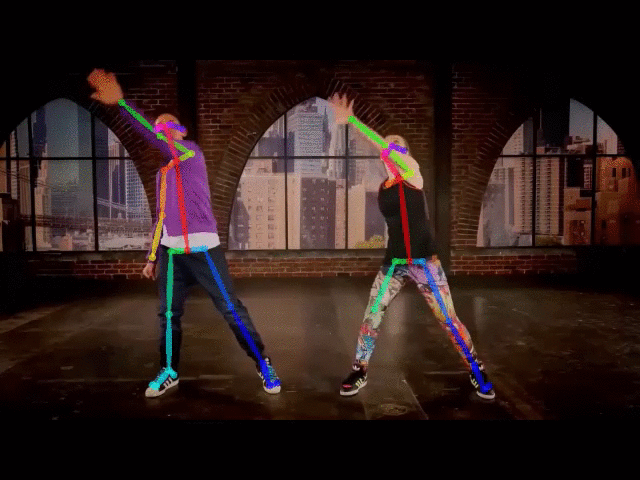

# Pose-Estimation
Pose Estimation using MediaPipe and OpenPose

In this repository, I trained MediaPipe and OpenPose models on [this YOUTUBE video](https://www.youtube.com/watch?v=sHd2s_saYsQ).
This video is about dancing along to 34 MINUTES of KIDZ BOP dance along videos with The KIDZ BOP Kids!

The included codes, which is in form of a IPython notebook, gets the video and performs preproccessing. Then, applying different layes, the key points of the human body will be extracted in each frame of the video. After that, the key points will be connected together, creating the estimated pose of the person.

Here are the result of the video with the models.

